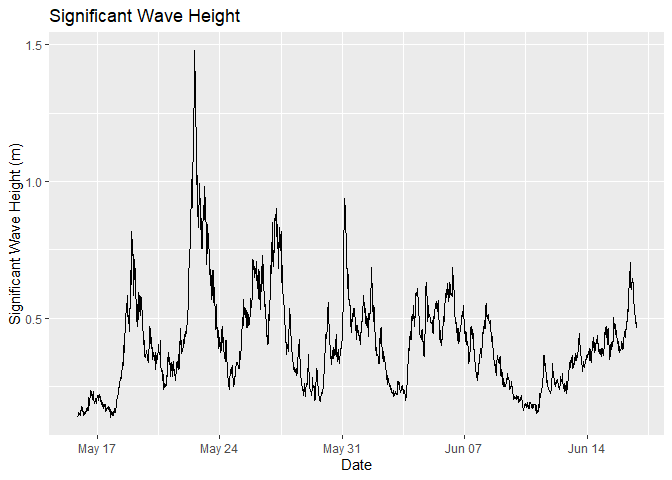

Waves
================

## Wavelogger

This is for managing and understanding your open wave height logger data

## Requirements

-   [R v4+](https://www.r-project.org/)
-   [dplyr](https://CRAN.R-project.org/package=dplyr)
-   [readr](https://CRAN.R-project.org/package=readr)
-   [stringr](https://CRAN.R-project.org/package=stringr)
-   [ggplot2](https://CRAN.R-project.org/package=ggplot2)
-   [oceanwaves](https://CRAN.R-project.org/package=oceanwaves)
-   [oce](https://CRAN.R-project.org/package=oce)
-   [owhlR](https://github.com/millerlp/owhlR) *from github*

## Installation

    remotes::install_github("rfrancolini/wavelogger")

## Read Example Data

``` r
library(wavelogger)
x <- read_wavelogger()
head(x)
```

    ## # A tibble: 6 x 3
    ##   DateTime            Pressure.mbar TempC
    ##   <dttm>                      <dbl> <dbl>
    ## 1 2021-05-15 05:00:00         1853.  7.63
    ## 2 2021-05-15 05:00:00         1853.  7.63
    ## 3 2021-05-15 05:00:00         1853.  7.63
    ## 4 2021-05-15 05:00:00         1852.  7.63
    ## 5 2021-05-15 05:00:01         1852   7.62
    ## 6 2021-05-15 05:00:01         1851.  7.62

## Read Air Pressure Data

``` r
a <- read_airpressure()
head(a)
```

    ## # A tibble: 6 x 4
    ##   Station_ID DateTime            sea_pressure.INHG sea_pressure.mbar
    ##   <chr>      <dttm>                          <dbl>             <dbl>
    ## 1 KRKD       2021-05-14 01:00:00              30.0             1016.
    ## 2 KRKD       2021-05-14 01:05:00              30.0             1017.
    ## 3 KRKD       2021-05-14 01:10:00              30.0             1017.
    ## 4 KRKD       2021-05-14 01:15:00              30.0             1017.
    ## 5 KRKD       2021-05-14 01:20:00              30.0             1017.
    ## 6 KRKD       2021-05-14 01:25:00              30.0             1017.

## Calculate Wave Statistcs

``` r
w <- wave_stats() 
head(w)
```

    ##          h       Hm0        Tp          m0    T_0_1    T_0_2      EPS2
    ## 1 8.293728 0.1615294 12.413793 0.001630735 5.965777 5.486326 0.4271034
    ## 2 8.289167 0.1710477  4.285714 0.001828583 5.623662 5.198539 0.4126045
    ## 3 8.162321 0.1723903  4.337349 0.001857401 5.463242 5.110284 0.3780299
    ## 4 7.946243 0.1696205  4.417178 0.001798195 5.288492 4.952050 0.3748281
    ## 5 7.665611 0.1649706  4.210526 0.001700957 5.497321 5.125210 0.3879167
    ## 6 7.304728 0.1367416  7.826087 0.001168642 5.469101 5.076757 0.4006711
    ##        EPS4            DateTime
    ## 1 0.6188682 2021-05-15 01:30:00
    ## 2 0.5872162 2021-05-15 02:00:00
    ## 3 0.5480540 2021-05-15 02:30:00
    ## 4 0.5421550 2021-05-15 03:00:00
    ## 5 0.5572305 2021-05-15 03:30:00
    ## 6 0.5797357 2021-05-15 04:00:00

## Graph Significant Wave Height

``` r
wave_plot <- wavespec_plot(w)
wave_plot
```

<!-- -->
